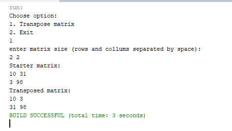
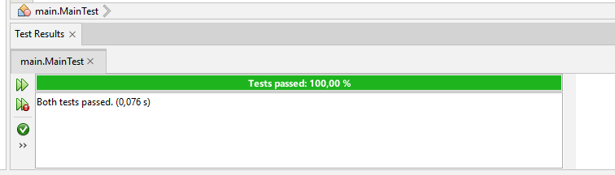

# Практична робота "Поглиблене використання масивів"
### *9 Завдання: Транспонувати (замінити рядки стовпцями) матрицю розміром N x M*

### Клас Calc:
[тиць](src/Calc.java)

Виконує всі обрахунки потрібні в практичній

### Клас Main:
[тиць](src/Main.java)

Забезпечує інтерфейс для користувача

### Клас MainTest:
[тиць](src/MainTest.java)

Тестує основні методи класу Calc

----
*Результати роботи програми:*

*Результати тестування програми:*

